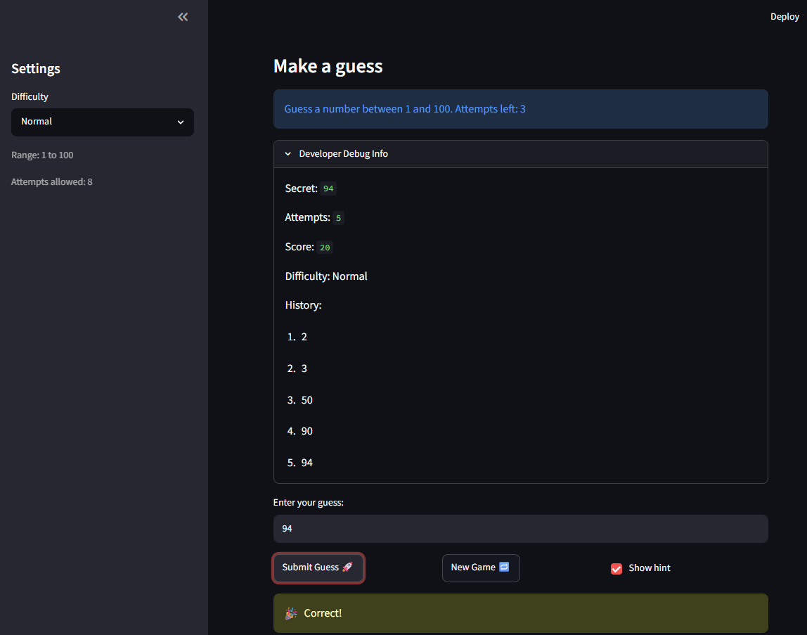

# 🎮 Game Glitch Investigator: The Impossible Guesser

## 🚨 The Situation

You asked an AI to build a simple "Number Guessing Game" using Streamlit.
It wrote the code, ran away, and now the game is unplayable. 

- You can't win.
- The hints lie to you.
- The secret number seems to have commitment issues.

## 🛠️ Setup

1. Install dependencies: `pip install -r requirements.txt`
2. Run the broken app: `python -m streamlit run app.py`

## 🕵️‍♂️ Your Mission

1. **Play the game.** Open the "Developer Debug Info" tab in the app to see the secret number. Try to win.
2. **Find the State Bug.** Why does the secret number change every time you click "Submit"? Ask ChatGPT: *"How do I keep a variable from resetting in Streamlit when I click a button?"*
3. **Fix the Logic.** The hints ("Higher/Lower") are wrong. Fix them.
4. **Refactor & Test.** - Move the logic into `logic_utils.py`.
   - Run `pytest` in your terminal.
   - Keep fixing until all tests pass!

## 📝 Document Your Experience

**Game purpose:** A number-guessing game where the player tries to guess a secret number within a limited number of attempts. After each guess the game gives a "Go Higher" or "Go Lower" hint. Different difficulty levels change the number range and attempt limit. The twist: the original AI-generated code shipped with several bugs that made it unplayable.

**Bugs found:**
- **Backwards hints** — `check_guess` had the comparison branches flipped, so guessing too low told you to go lower and vice versa.
- **Attempts off by one** — `st.session_state.attempts` was initialized to `1` instead of `0`, so the "Attempts left" counter started one short.
- **New Game didn't reset properly** — clicking "New Game" only reset `attempts` and `secret`; it left `history`, `score`, and `status` (the "Game over" box) from the previous game.
- **History only updated after a second interaction** — the Debug Info panel was rendered before the submit handler ran, so the new guess didn't appear until a later rerun.
- **Non-numeric input burned an attempt** — `attempts` was incremented before input was validated, so typing `abc` still used up a guess.
- **Easy difficulty had fewer attempts than Normal** — `attempt_limit_map` gave Easy 6 and Normal 8, which is backwards.

**Fixes applied:**
- Refactored `get_range_for_difficulty`, `parse_guess`, `check_guess`, and `update_score` out of `app.py` into `logic_utils.py` so they can be unit-tested without Streamlit.
- Fixed the comparison branches in `check_guess` (`guess > secret` → `"Too High"`, else `"Too Low"`); separated hint text into a `HINT_MESSAGES` dict in `app.py`.
- Changed `st.session_state.attempts` init from `1` to `0`.
- Extended the "New Game" block to also reset `history`, `score`, and `status`, and to use the difficulty range instead of hardcoded `1, 100`.
- Added `st.rerun()` at the end of the submit handler so the history panel redraws immediately; persisted hint/outcome messages in a `session_state.flash` queue so they survive the rerun.
- Numbered the history list from 1 using `enumerate(start=1)`.
- Added `tests/test_bug_fixes.py` with regression tests for hint direction, parse errors, and difficulty ranges.

## 📸 Demo Walkthrough

Describe your fixed game in numbered steps so a reader can follow along without watching a video:

1. User opens the app on Normal difficulty (range 1–100, 8 attempts allowed). A
  new secret number is picked.
2. User guesses **40** → hint shows "📈 Go HIGHER!" and History immediately
  updates to show "1. 40".
3. User guesses **70** → hint shows "📉 Go LOWER!" and History updates to "1. 40
   2. 70". Score adjusts after each guess.
4. User guesses **55** → hint shows "📈 Go HIGHER!". Attempts left counts down
  correctly with each submission.
5. User guesses **62** → 🎉 Correct! Balloons appear, score is displayed, and
  the game sets status to "won".
6. User clicks "New Game 🔁" → board fully resets: History clears, attempts
  return to 8, and a fresh secret is picked.

**Screenshot** *(optional)*: <!-- Insert a screenshot of your fixed, winning game here -->
 

## 🧪 Test Results

```
$ python -m pytest -v
============================= test session starts =============================
platform win32 -- Python 3.11.9, pytest-9.0.3, pluggy-1.6.0
rootdir: C:\Users\HUAWEI\ai110-module1show-gameglitchinvestigator-starter
plugins: anyio-4.9.0
collected 8 items

tests/test_game_logic.py::test_winning_guess PASSED                      [ 12%]
tests/test_game_logic.py::test_guess_too_high PASSED                     [ 25%]
tests/test_game_logic.py::test_guess_too_low PASSED                      [ 37%]
tests/test_game_logic.py::test_hint_direction_at_extremes PASSED         [ 50%]
tests/test_game_logic.py::test_non_numeric_input_is_rejected PASSED      [ 62%]
tests/test_game_logic.py::test_empty_input_is_rejected PASSED            [ 75%]
tests/test_game_logic.py::test_valid_number_is_parsed PASSED             [ 87%]
tests/test_game_logic.py::test_difficulty_ranges PASSED                  [100%]

============================== 8 passed in 0.02s ==============================
```

